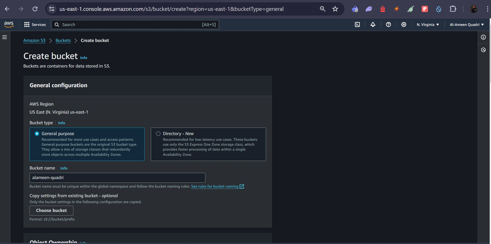
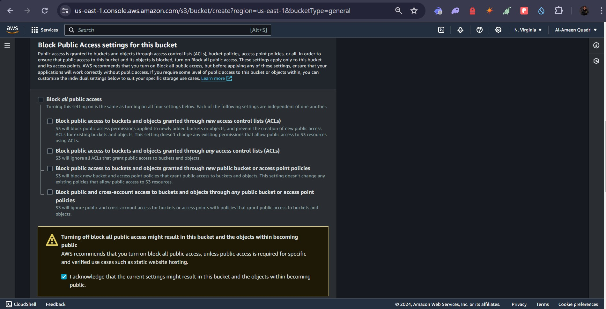
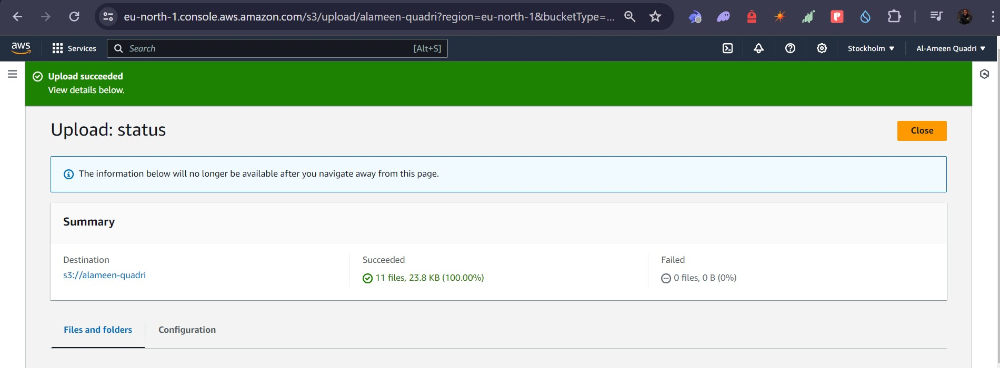
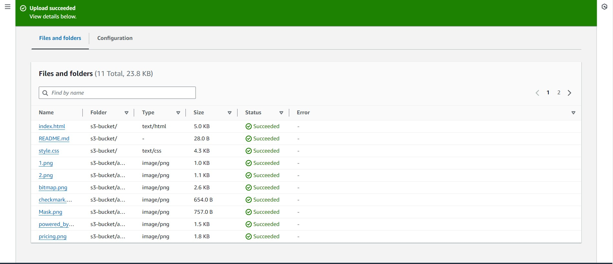
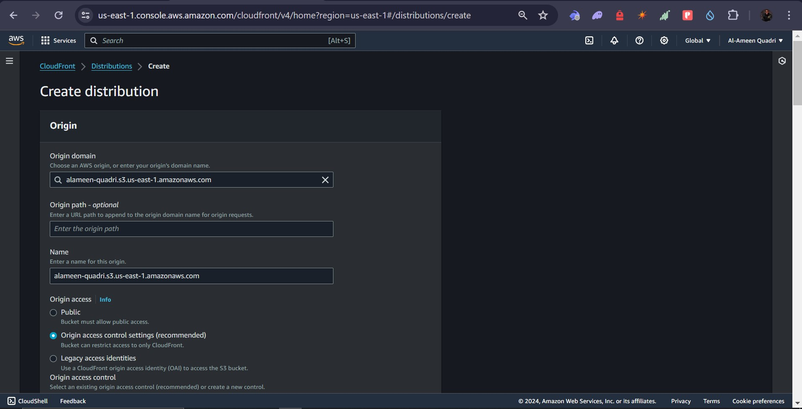
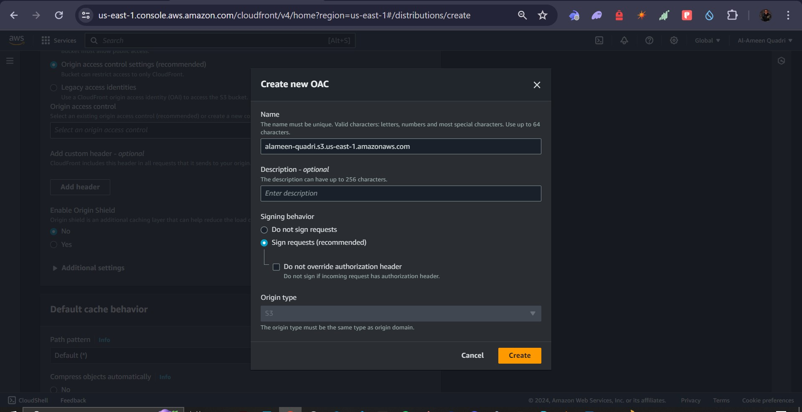
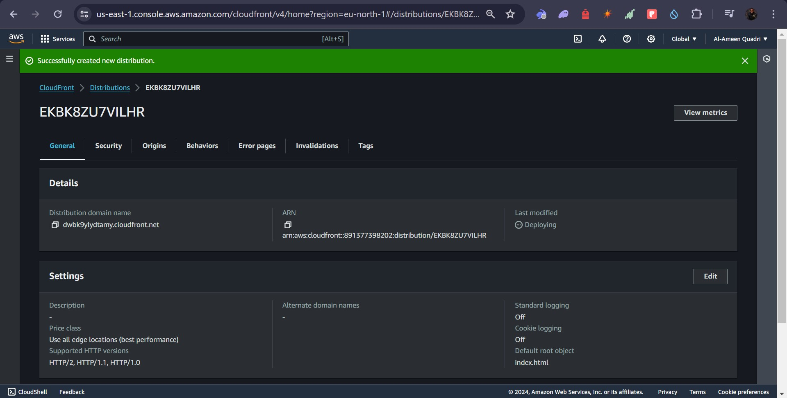
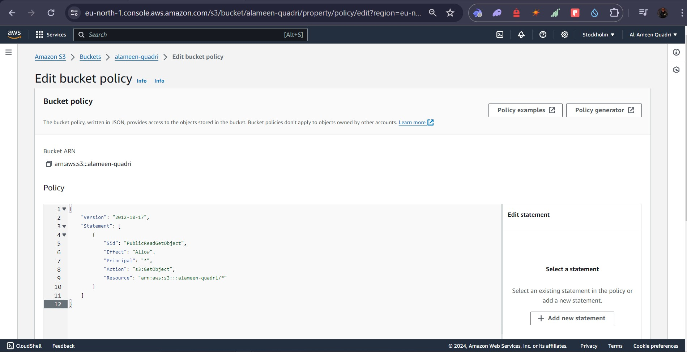
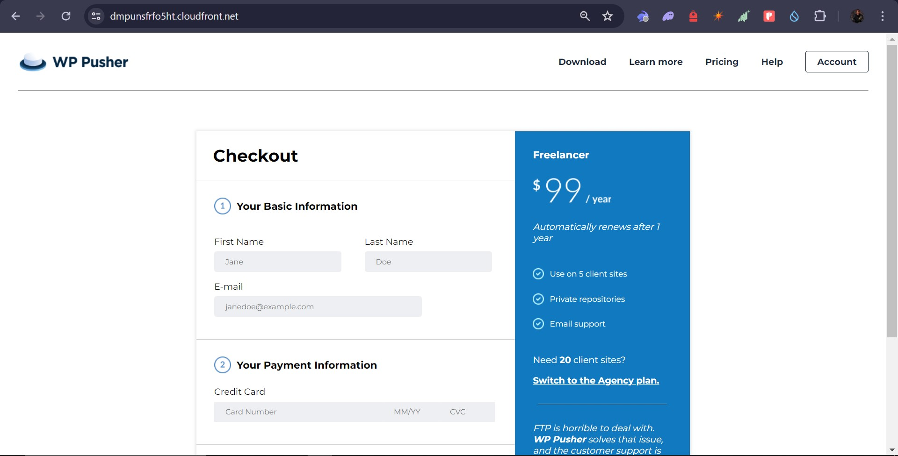

# Create a static website and host it on S3 bucket

## Step one: Create a S3 Bucket
### Screenshots;
#### Images show how a s3 bucket is created

## Step two: Upload website files
### Screenshots;
#### Images show how files are being uploaded

## Step three: Create distribution in Cloudfront
### Screenshots;
#### Images show how distribution was created with cloudfront

## Step four: Edit bucket policy
### Screenshots;
#### Image shows editing of bucket policy

## Step five: Test the static website
### Screenshots;
#### we can then go back to cloudfront, copy url generated and test on a webbrowser.
